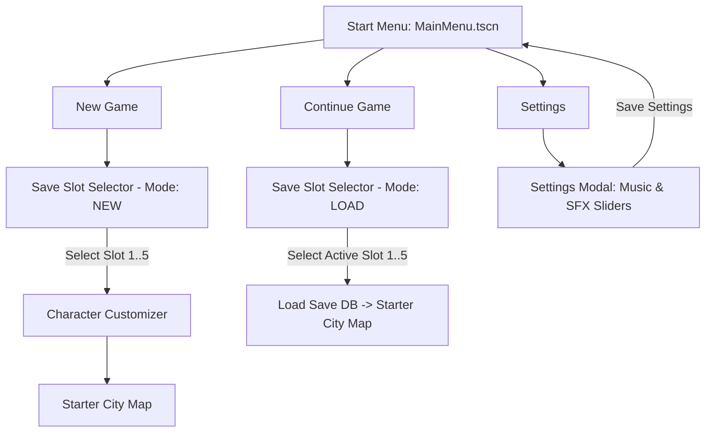
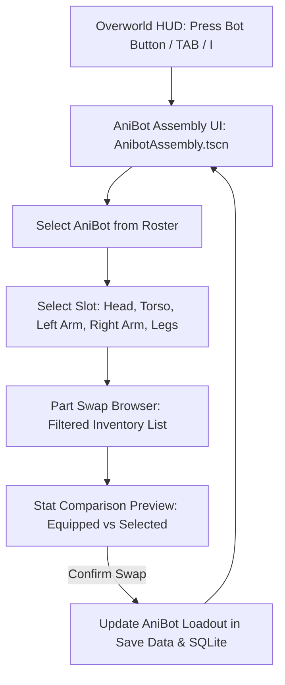

# AniBots - Game Implementation Plan & Architecture Specification (`GAME.md`)

> [!NOTE]
> - **Game Design & Formulas**: See [OVERVIEW.md](./OVERVIEW.md) for core combat loop, utility AI targeting, and degradation math.
> - **Anima Chips Catalog**: See [CHIPS.md](./CHIPS.md) for all 36 mass-market AI cores and traits.
> - **Characters & Frames**: See [CHARACTERS.md](./CHARACTERS.md) for Zerdata chassis anatomy and the 10 Ancient Cores.
> - **Project Portal**: See [README.md](./README.md) for engine setup and the complete documentation directory.

---

## 1. Project Overview & Technical Foundation

- **Engine:** Godot Engine 4.x (GL Compatibility / Mobile / Desktop target)
- **Primary Language:** GDScript 2.0 (Strict typing enabled)
- **Architecture Pattern:** Composition over Inheritance, Event Bus Signal decoupling, Autoload Singletons
- **Data Persistence:** Dual SQLite Database (`godot-sqlite` plugin / GDExtension / JSON ACID driver fallback)
  - `user://settings.cfg` or `user://global_settings.db`: Global configuration (audio volumes, display settings)
  - `user://saves/slot_{1..5}.db` (or `slot_{1..5}.json`): 5 isolated, ACID-compliant SQLite player save slots

```text
res://
├── assets/
│   ├── audio/
│   │   ├── music/
│   │   └── sfx/
│   ├── sprites/
│   │   ├── character/
│   │   ├── environment/
│   │   ├── anibots/
│   │   └── ui/
│   └── shaders/
├── src/
│   ├── autoload/
│   │   ├── GameManager.gd
│   │   ├── SaveManager.gd
│   │   ├── AudioManager.gd
│   │   └── SceneRouter.gd
│   ├── core/
│   │   ├── DatabaseService.gd
│   │   ├── Types.gd
│   │   └── SignalBus.gd
│   ├── scenes/
│   │   ├── ui/
│   │   │   ├── MainMenu.tscn
│   │   │   ├── SaveSlotSelector.tscn
│   │   │   ├── SettingsMenu.tscn
│   │   │   ├── CharacterCustomizer.tscn
│   │   │   ├── DialogueBox.tscn
│   │   │   └── AnibotAssembly.tscn          # <-- AniBot & Part Swapping Garage
│   │   ├── overworld/
│   │   │   ├── StarterCity.tscn
│   │   │   ├── Player.tscn
│   │   │   ├── CompositeCharacter.gd
│   │   │   └── npc/
│   │   │       ├── NPCBase.tscn
│   │   │       └── SparringNPC.tscn
│   │   └── combat/
│   │       ├── BattleArena.tscn
│   │       ├── CombatUnit.tscn
│   │       └── CombatUI.tscn
└── project.godot
```

---

## 2. Core Singletons & Architecture

### 2.1 Autoload List (`project.godot`)

1. `SignalBus` (`res://src/core/SignalBus.gd`): Global decoupled event broker.
2. `AudioManager` (`res://src/autoload/AudioManager.gd`): Audio buses, volume interpolation, SFX pooling.
3. `SaveManager` (`res://src/autoload/SaveManager.gd`): Multi-slot save/load pipeline and inventory manager.
4. `GameManager` (`res://src/autoload/GameManager.gd`): Game state coordinator (Menu, Overworld, Assembly, Battle).
5. `SceneRouter` (`res://src/autoload/SceneRouter.gd`): Scene transitions with screen fade.

### 2.2 Global Event Bus (`SignalBus.gd`)

```gdscript
extends Node

# Audio Signals
signal volume_changed(bus_name: String, volume_linear: float)
signal play_sfx_requested(sfx_name: String)

# Save / Load Signals
signal save_created(slot_index: int)
signal save_loaded(slot_index: int)
signal save_deleted(slot_index: int)
signal game_saved()

# Character Customization Signals
signal character_appearance_changed(appearance_data: Dictionary)

# Overworld & Interaction Signals
signal player_moved(position: Vector2)
signal interaction_triggered(npc_node: Node)
signal dialogue_requested(dialogue_data: Dictionary)
signal dialogue_choice_selected(choice_index: int)
signal dialogue_finished()

# AniBot & Part Assembly Signals
signal anibot_assembly_opened()
signal anibot_part_swapped(bot_id: String, slot: int, new_part_id: String)
signal anibot_assembly_closed()

# Battle Signals
signal combat_started(battle_context: Dictionary)
signal combat_phase_changed(unit_id: String, phase: int)
signal combat_action_executed(attacker_id: String, target_id: String, part_used: Dictionary, damage_dealt: int)
signal combat_ended(player_won: bool, rewards: Dictionary)
```

---

## 3. Start Menu & System Settings

### 3.1 Flow & State Diagram



### 3.2 5-Slot Save System (`SaveManager.gd`)

- Tracks active slot index (`current_slot_id: int` from `1` to `5`).
- Save files stored at `user://saves/slot_1.json` through `user://saves/slot_5.json` (or SQLite `slot_X.db`).
- Save slot metadata preview displays: Player Name, Starter Chip, Playtime (`HH:MM`), Last Saved timestamp, Credits, and Scrap.

### 3.3 Audio Settings System (`AudioManager.gd` & `SettingsMenu.tscn`)

- Godot Audio Bus Layout:
  - Bus 0: `Master`
  - Bus 1: `Music` (routed to Master)
  - Bus 2: `SFX` (routed to Master)
- Linear (0.0 to 1.0) to Decibel conversion: `linear_to_db(value)` with mute floor below `0.01` (`-80.0 dB`).
- Real-time procedural tone/synthesis fallback for UI clicks, attacks, lasers, and explosions.

---

## 4. Character Customization System

### 4.1 Customization Categories & Options

1. **Hair Style:** `hair_01` (Spiky Punk), `hair_02` (Side Part), `hair_03` (Ponytail), `hair_04` (Buzz Cut), `hair_05` (Messy Anime).
2. **Hair Color:** 7 rich palette swatches (Midnight Black `#1A1A1A`, Chestnut Brown `#5D4037`, Golden Blonde `#FBC02D`, Crimson Red `#D32F2F`, Neon Cyan `#00BCD4`, Electric Purple `#7B1FA2`, Silver Ash `#CFD8DC`).
3. **Skin Color:** 6 tone swatches (Fair `#FFDFC4`, Peach `#F0D5BE`, Warm Sand `#E0AC69`, Bronze `#C68642`, Deep Mocha `#8D5524`, Espresso `#3D2314`).
4. **Shirt:** Styles (`shirt_tshirt`, `shirt_jacket`, `shirt_hoodie`) + Color swatches.
5. **Shorts / Bottoms:** Styles (`bottom_shorts`, `bottom_cargo`, `bottom_jeans`) + Color swatches.
6. **Shoes:** Styles (`shoes_sneakers`, `shoes_boots`, `shoes_sandals`) + Color swatches.

### 4.2 Composite Layered Sprite Architecture (`CompositeCharacter.gd`)

**Chibi Aesthetic (Pokémon Brilliant Diamond / BDSP Inspired)**:

- **Proportions:** Large rounded chibi head (1:1.5 ratio with body), chubby cheeks with soft blush, and compact torso.
- **Expressive Eyes:** Big anime vertical oval eyes with iris gradient and dual white shine sparkles.
- **Dynamic Chibi Walk Cycle:** Bouncy step oscillations (`sin(walk_time)`), leg swing, chubby arm swing, and scaling drop shadow.
- **Hair Highlights:** Volumetric polygon highlights and shines across all 5 hairstyles.

---

## 5. Starter City (Overworld)

### 5.1 Visual Environment Design (Sinnoh / BDSP Palette)

- **Ground & Pathways:** Saturated emerald green grass with checkerboard tile accents, soft cobblestone cream streets, and central circular plaza with fountain water pool.
- **Nature Decor:** Layered puffy cartoon trees with drop shadows, vibrant multi-colored flower patches (red, yellow, cyan, violet petals).
- **Buildings:** Miniature workshop with bright cyan pitched roof, wooden signplate, and glowing windows.
- **Sparring Ring:** Southeast neon-lit arena platform with corner energy posts.

### 5.2 Scene Tree & World Hierarchy (`StarterCity.tscn`)

```text
StarterCity (Node2D)
├── Boundaries (StaticBody2D with WorldBoundary collision walls)
├── WorkshopBuilding (StaticBody2D structure with visual lab decor)
├── YSortRoot (Node2D - y_sort_enabled = true)
│   ├── SparringNPC (CharacterBody2D / Sparring Coordinator "Bolt")
│   └── Player (CharacterBody2D with RayCast2D interaction probe)
└── HUD (CanvasLayer)
    ├── TopBar (Location Badge, Active Bot Name, Scrap & Credits Counter)
    ├── BotButton ("[TAB] AniBots / Garage")      # <-- Opens Assembly Modal
    ├── MenuButton ("Pause / Save")
    ├── DialogueBox (DialogueUI instance)
    ├── AnibotAssembly (Assembly & Part Swap UI)   # <-- Assembly Component
    └── PauseModal (Pause & Return to Menu)
```

### 5.2 Top-Down Player Controller (`Player.gd`)

- Movement: 8-directional top-down movement with diagonal speed normalization (`move_left`, `move_right`, `move_up`, `move_down`).
- Interaction Probe: `RayCast2D` rotating in facing direction, detecting direct or parent interactable nodes.
- Control Lock: Disables movement automatically during dialogues, menus, or scene transitions.

---

## 6. Combat Test NPC & Arena Integration

### 6.1 Sparring NPC Setup (`SparringNPC.tscn`)

- **NPC:** "Bolt" (Sparring Coordinator).
- **Proximity:** When player approaches, displays animated `[E] Talk` prompt bubble.
- **Input:** Pressing `E` or `Space` in range opens branching dialogue:
  1. *Let's battle!* $\rightarrow$ Launches 3-Phase ATB Sparring Arena against Training Drone.
  2. *Explain combat rules.* $\rightarrow$ Explains Wait/Run/Action/Cooldown and Head destruction win condition.
  3. *Maybe later.* $\rightarrow$ Closes dialogue.

### 6.2 3-Phase ATB Battle Arena (`BattleArena.tscn`)

- **Relay Track:** Player Base Line `(220px)` $\leftrightarrow$ Center Combat Line `(640px)` $\leftrightarrow$ Enemy Base Line `(1060px)`.
- **Phase Loop:**
  1. `WAIT`: Leg clock speed fills Action Bar at base line.
  2. `COMMAND`: Player selects weapon payload (Head with cache, Left Arm, Right Arm, or Overclock Ultimate).
  3. `RUN`: Robot sprints to center line with speed modified by Leg condition.
  4. `ACTION & COOLDOWN`: Delivers payload attack to enemy part, calculates damage/armor mitigation, and returns to base line with latency modified by weapon weight & Torso cooling.
- **Win Condition:** Destroy enemy Head part (System Failure) $\rightarrow$ Awards 20 Scrap + Salvage Part drop.

---

## 7. AniBot Assembly & Part Inventory System (Garage UI)

> [!IMPORTANT]
> Modeled directly after the classic **Medabots (Metabee Version)** assembly mechanics: players can inspect their AniBots, view slot stats, and replace individual parts with spare parts from their inventory.



### 7.1 HUD Access & Shortcuts

- **Overworld HUD Button:** Top bar features an **"AniBots / Garage"** button.
- **Keyboard Shortcuts:** Pressing `Tab` or `I` toggles the Anibot Assembly modal.
- **Game Freeze:** Opening the assembly modal safely pauses player overworld movement.

### 7.2 Assembly Scene Hierarchy (`AnibotAssembly.tscn`)

```text
AnibotAssembly (Control - CanvasLayer)
├── DimBackground (ColorRect)
└── CenterContainer
    └── AssemblyPanel (PanelContainer - 960x600)
        └── Margin
            └── HBoxContainer
                ├── LeftBotSummaryPanel (320px)
                │   ├── BotSelectorDropdown / OptionButton
                │   ├── BotVisualPreview (Node2D)
                │   ├── EquippedChipCard (Name, Series, Affinity, Level)
                │   └── TotalBotStats (Total Integrity, Total Weight, Max Loadout, Avg Latency)
                ├── CenterSlotsPanel (280px)
                │   ├── SlotCard_Head (Equipped Part, Condition %, Cache uses, [Swap] button)
                │   ├── SlotCard_Torso (Chassis, Firewall, Max Loadout, Cooling, [Swap] button)
                │   ├── SlotCard_LArm (Weapon Name, Payload, Latency, [Swap] button)
                │   ├── SlotCard_RArm (Weapon Name, Payload, Latency, [Swap] button)
                │   └── SlotCard_Legs (Leg Type, Clock Speed, Evasion %, [Swap] button)
                └── RightInventoryPanel (360px)
                    ├── SlotFilterTitle ("Available LEFT ARM Parts")
                    ├── InventoryScrollList (ScrollContainer with available spare parts)
                    │   └── PartItemCards (Name, Condition %, Stats, [Equip] button)
                    ├── StatComparisonDiffBox (Green/Red stat changes vs currently equipped)
                    └── CloseButton ("Close Garage")
```

### 7.3 Medabots-Style Part Swapping Rules & Mechanics

1. **Slot-Filtered Inventory:**
   - When the player clicks on the **[Left Arm]** slot, the right-hand browser automatically filters to show only `LEFT_ARM` parts in the player's inventory that are not currently equipped on another AniBot.
2. **Stat Comparison Preview:**
   - Hovering or selecting an inventory part displays a side-by-side comparison:
     - $\Delta \text{Integrity}$ (e.g. `65 HP` $\rightarrow$ `55 HP` <font color="red">(-10)</font>)
     - $\Delta \text{Payload}$ (e.g. `28 Power` $\rightarrow$ `38 Power` <font color="green">(+10)</font>)
     - $\Delta \text{Latency}$ (e.g. `2.8s` $\rightarrow$ `4.8s` <font color="red">(+2.0s cooldown)</font>)
     - $\Delta \text{Weight}$ (e.g. `8` $\rightarrow$ `12` <font color="red">(+4 load)</font>)
3. **Torso Max Loadout Validation:**
   - Total equipped weight ($Weight_{Head} + Weight_{LArm} + Weight_{RArm}$) cannot exceed the equipped Torso's `max_loadout`.
   - If a swap exceeds bandwidth, a warning indicator displays: `"OVERWEIGHT: Cooldown latency penalized by 50%!"`
4. **Chip Affinity Indicator:**
   - If an equipped part matches the active Anima Chip's Affinity (e.g. `MELEE` part with `Artificer` or `SHOOTING` with `Orion`), a glowing **"AFFINITY MATCH (+10% Stat Bonus)"** badge lights up.
5. **Instant Unequip & Swap Transaction:**
   - Swapping a part immediately returns the old part to `inventory_parts` with its existing `condition_percent` preserved.
   - The new part is slotted into `active_anibot.parts[slot]` and marked `is_equipped = 1` in SQLite/Save state.

---

## 8. Complete Database & Save Schema (`slot_X.db`)

```sql
-- 1. Save Slot Metadata
CREATE TABLE IF NOT EXISTS save_metadata (
    id INTEGER PRIMARY KEY CHECK (id = 1),
    player_name TEXT NOT NULL DEFAULT 'Handler',
    playtime_seconds INTEGER DEFAULT 0,
    created_at DATETIME DEFAULT CURRENT_TIMESTAMP,
    last_saved_at DATETIME DEFAULT CURRENT_TIMESTAMP,
    starter_chip TEXT NOT NULL,
    location_name TEXT NOT NULL DEFAULT 'Circuit City - Sector 0',
    pos_x REAL DEFAULT 600.0,
    pos_y REAL DEFAULT 410.0
);

-- 2. Character Customization Cosmetics
CREATE TABLE IF NOT EXISTS player_customization (
    id INTEGER PRIMARY KEY CHECK (id = 1),
    hair_style TEXT NOT NULL DEFAULT 'hair_01',
    hair_color TEXT NOT NULL DEFAULT '#1A1A1A',
    skin_color TEXT NOT NULL DEFAULT '#F0D5BE',
    shirt_style TEXT NOT NULL DEFAULT 'shirt_tshirt',
    shirt_color TEXT NOT NULL DEFAULT '#1976D2',
    bottom_style TEXT NOT NULL DEFAULT 'bottom_shorts',
    bottom_color TEXT NOT NULL DEFAULT '#37474F',
    shoe_style TEXT NOT NULL DEFAULT 'shoes_sneakers',
    shoe_color TEXT NOT NULL DEFAULT '#FAFAFA'
);

-- 3. Economy & Scrap
CREATE TABLE IF NOT EXISTS player_economy (
    id INTEGER PRIMARY KEY CHECK (id = 1),
    credits INTEGER DEFAULT 500,
    scrap INTEGER DEFAULT 25,
    patch_kits INTEGER DEFAULT 2
);

-- 4. Modular AniParts Inventory (Owned spare parts)
CREATE TABLE IF NOT EXISTS part_inventory (
    item_uuid TEXT PRIMARY KEY,
    part_id TEXT NOT NULL,             -- References Types.PARTS_CATALOG (e.g. part_arm_l_pulsar_rifle)
    slot_type INTEGER NOT NULL,        -- 0: HEAD, 1: TORSO, 2: LEFT_ARM, 3: RIGHT_ARM, 4: LEGS
    condition_percent REAL DEFAULT 100.0, -- Persistent wear & tear (0 to 100)
    current_cache INTEGER DEFAULT -1,  -- Remaining head uses
    is_equipped INTEGER DEFAULT 0,     -- 1 if slotted on an Anibot, 0 if in inventory bag
    equipped_to_bot_id TEXT DEFAULT ''
);

-- 5. Anima Chips Inventory
CREATE TABLE IF NOT EXISTS chip_inventory (
    chip_uuid TEXT PRIMARY KEY,
    chip_id TEXT NOT NULL,             -- References Types.CHIPS_CATALOG (e.g. chip_artificer)
    level INTEGER DEFAULT 1,
    experience INTEGER DEFAULT 0,
    is_equipped INTEGER DEFAULT 0,
    equipped_to_bot_id TEXT DEFAULT ''
);

-- 6. Assembled AniBots Roster
CREATE TABLE IF NOT EXISTS assembled_anibots (
    bot_id TEXT PRIMARY KEY,
    bot_name TEXT NOT NULL,
    chip_uuid TEXT,
    head_part_uuid TEXT,
    torso_part_uuid TEXT,
    left_arm_uuid TEXT,
    right_arm_uuid TEXT,
    legs_part_uuid TEXT,
    is_active_in_battle INTEGER DEFAULT 1,
    FOREIGN KEY(chip_uuid) REFERENCES chip_inventory(chip_uuid),
    FOREIGN KEY(head_part_uuid) REFERENCES part_inventory(item_uuid),
    FOREIGN KEY(torso_part_uuid) REFERENCES part_inventory(item_uuid),
    FOREIGN KEY(left_arm_uuid) REFERENCES part_inventory(item_uuid),
    FOREIGN KEY(right_arm_uuid) REFERENCES part_inventory(item_uuid),
    FOREIGN KEY(legs_part_uuid) REFERENCES part_inventory(item_uuid)
);
```

---

## 9. Implementation Roadmap

### Phase 1: Core Foundation & UI Frame [COMPLETED]

- [x] Configure `project.godot` (Input maps, autoloads, screen resolution).
- [x] Configure Audio Buses (`Master`, `Music`, `SFX`) in `default_bus_layout.tres`.
- [x] Implement singletons: `SignalBus.gd`, `AudioManager.gd`, `SaveManager.gd`, `GameManager.gd`, `SceneRouter.gd`.
- [x] Implement `MainMenu.tscn`, `SaveSlotSelector.tscn` (5 slots), and `SettingsMenu.tscn`.

### Phase 2: Character Customizer Pipeline [COMPLETED]

- [x] Create procedural composite avatar renderer `CompositeCharacter.gd`.
- [x] Implement `CharacterCustomizer.tscn` with interactive palette swatches and live preview.
- [x] Wire save logic to store customizer dictionary into active save slot.

### Phase 3: Starter City & Sparring NPC [COMPLETED]

- [x] Create 2D map `StarterCity.tscn` (roads, buildings, plaza, sparring ring, boundary walls).
- [x] Implement `Player.tscn` with 8-direction movement and interaction probe.
- [x] Implement `SparringNPC.tscn` with proximity prompt bubble and dialogue choices.

### Phase 4: 3-Phase ATB Combat Prototype [COMPLETED]

- [x] Implement `CombatUnit.tscn` with 3-Phase ATB relay state machine (`WAIT`, `COMMAND`, `RUN`, `COOLDOWN`).
- [x] Implement `CombatUI.tscn` with action command menu, part HP bars, and combat announcer.
- [x] Implement `BattleArena.tscn` sparring battle against training drone with victory scrap rewards.

### Phase 5: AniBot Assembly & Part Swapping (Garage UI) [COMPLETED]

- [x] Implement `AnibotAssembly.tscn` & `AnibotAssembly.gd` (HUD garage modal).
- [x] Bind Overworld HUD "AniBots" button and `Tab` / `I` keyboard shortcuts.
- [x] Implement slot-filtered inventory part selection and stat comparison card.
- [x] Implement part swap transactions (unequip $\rightarrow$ inventory, equip $\rightarrow$ bot) and save sync.

### Phase 6: Workshop Interior & Parts Shopkeeper NPC [COMPLETED]

- [x] Create `WorkshopInterior.tscn` (chibi lab map with workbenches, Anibot pod, and exit door warp).
- [x] Implement `ShopkeeperNPC.tscn` ("Clara - Master Artificer" with shop & repair dialogues).
- [x] Implement `PartsShop.tscn` & `PartsShop.gd` (slot filter, part stat inspect, buy with Credits, repair all with Scrap).
- [x] Implement door entry warp between `StarterCity` and `WorkshopInterior`.
- [x] Add economy transaction methods in `SaveManager.gd` (`deduct_credits`, `purchase_part`, `repair_all_parts`).
