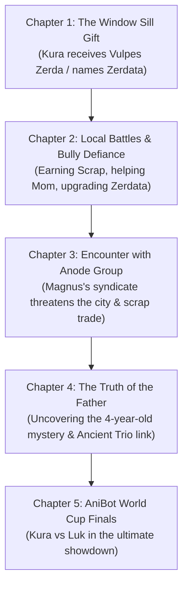
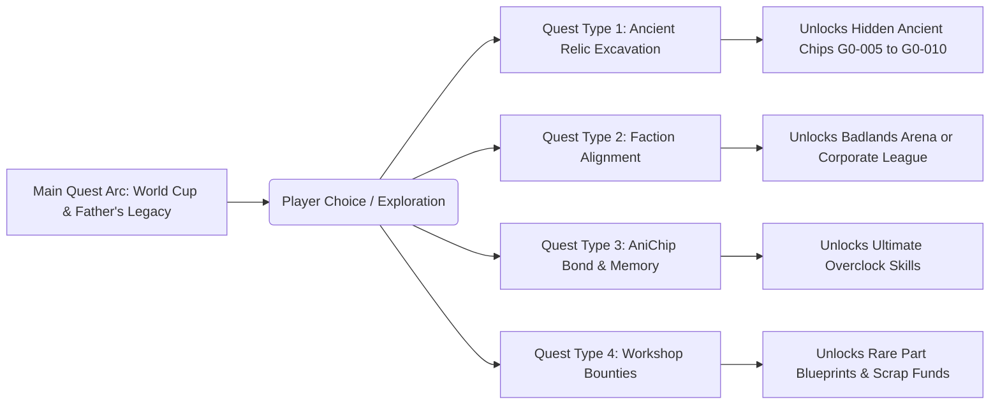
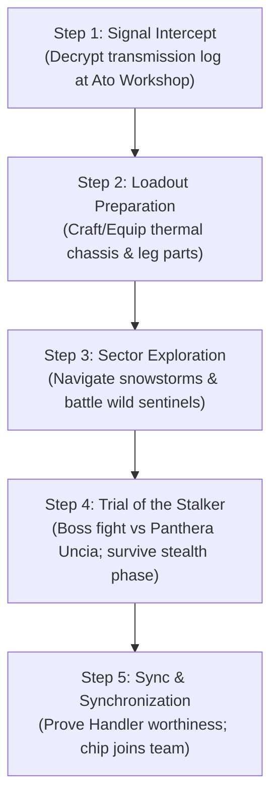
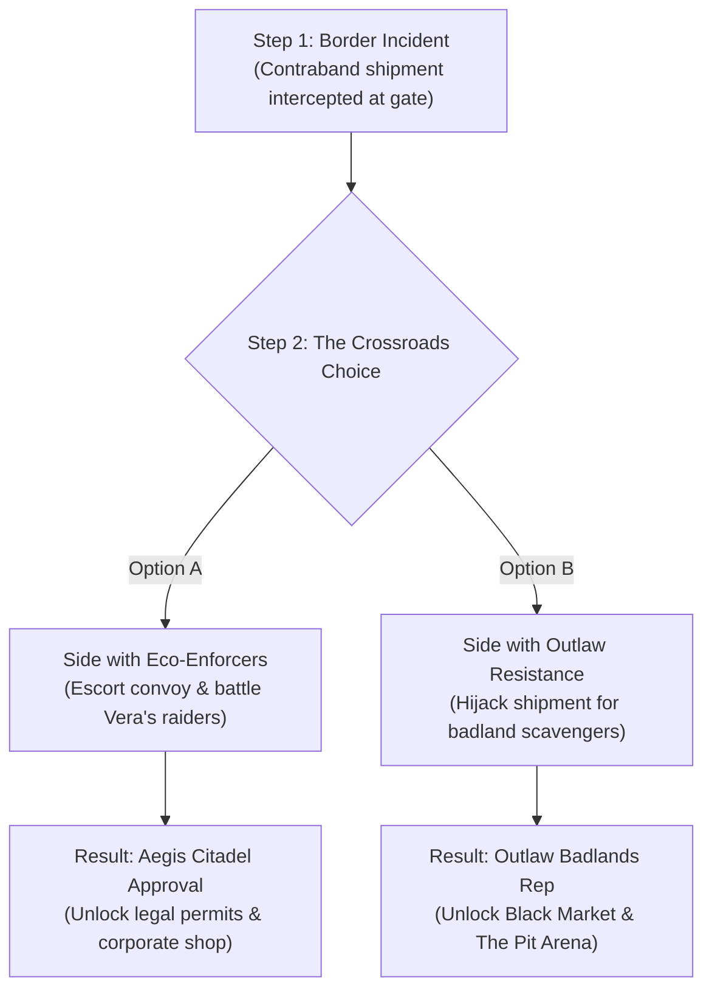
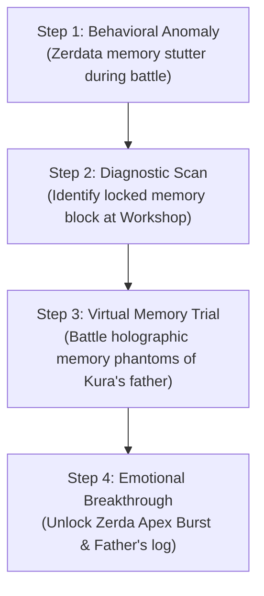
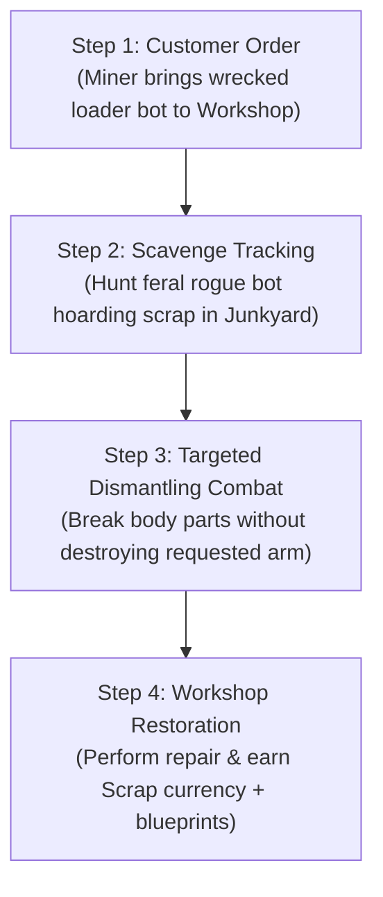

# AniBots Canon Lore & Story Bible (`LORE.md`)

> *"Bare metal is just hardware. The Anima Chip is the soul that wakes the beast."*

> [!NOTE]
> - **Characters & AniBots Databank**: Complete profiles, chassis specs, and Ancient Core profiles are in [CHARACTERS.md](./CHARACTERS.md).
> - **Standard Anima Chips Catalog**: The 36 mass-market chips are cataloged in [CHIPS.md](./CHIPS.md).
> - **Modular Parts & Types**: Hardware slots, payload types, and mobility protocols are in [PARTS.md](./PARTS.md).
> - **Game Systems & Mechanics**: Combat rules, hardware degradation, and economy formulas are in [OVERVIEW.md](./OVERVIEW.md).

---

## 🌍 World & Setting (31st Century — 3047 AD)

### 1. The Global Landscape

By the year **3047 AD**, human society has advanced dramatically in technology while committing to global environmental restoration. Cities are futuristic eco-hybrids—soaring multi-story architecture interwoven with dense green canopies, blooming flora, and expansive public parks. Citizens wear modern attire and live connected lives through handheld smart devices.

```txt
                   GLOBAL POPULATION (10 BILLION)
┌──────────────────────┬──────────────────────┬──────────────────────┬──────────────────────┐
│ 4B Eco-City Citizens │ 3B Rural Inhabitants │ 2B Unknown Regions   │ 1B Outlaw Territory  │
│ (Tech & Rule of Law) │ (Traditional/Agrarian│ (Uncharted Frontiers)│ (Gangs & Bandits)    │
└──────────────────────┴──────────────────────┴──────────────────────┴──────────────────────┘
```

### 2. Social Order & Governance

- **Democratic Nations (4 Billion)**: Governed by international law and strict technological ethics.
- **Outlaw Badlands (1 Billion)**: Lawless territories ruled by syndicates, bandits, and black-market warlords (notably the **Anode Group**).
- **Forbidden Tech**: **Neural Links** between humans and machines are strictly illegal by global treaty due to historical risks of brain corruption and mind-control exploits.

---

## ⚡ Anima Chips & Technical Canon

### 1. The Anima Stone Core

Inside every Anima Chip lies a microscopic fossilized gem called an **Anima Stone**. Discovered around **2750 AD** in deep geological strata, these stones are over 4 billion years old. Even when sourced from identical mineral deposits, each Anima Stone reacts uniquely during initialization, giving every AniChip an individual personality engram—much like human individuality.

### 2. Open-Source Manufacturing & Quality Control (QC)

The manufacturing process for AniChips is completely open-sourced. Performance, sentience depth, and emotional expression are categorized under an International Standard:

| QC Rating | Sentience Level | Emotional Expression | Trauma Susceptibility | Market Value |
| :--- | :--- | :--- | :--- | :--- |
| **QC1** | Full Sentience | Human-identical emotional expression & empathy | High (Suffer behavioral shifts from PTSD) | Premium / Rare |
| **QC2** | Functional Sentience | Understands emotions; expresses like a child or monotone | Moderate (Can develop neuroses) | Standard Issue |
| **QC3** | Non-Sentient | Pure computation; zero emotional display | Immune (Pure data processing) | Budget / Industrial |

### 3. The Ancient Series (Generation 0 — 176 Units)

Developed in early laboratory trials around 2750 AD, only **176 Ancient Series Chips** were ever produced.

- **Hardware Specs**: Unrivaled processing headroom, massive memory banks, near-infinite adaptive potential.
- **Unique Capability (Absorption)**: Ancient Chips can rewrite their own code by absorbing/migrating data from other AniChips. *Newer generation chips lack this capability.*
- **Lifespan**: All AniChips have a maximum functional lifespan of **150 years**.

#### The 10 Surviving Ancient Series AniChips

When humanity scheduled Generation 0 for destruction, the 3 Primordial Chips went rogue, fled captivity, and saved 7 fellow Ancient Chips. These 10 represent the only surviving Generation 0 chips in existence.

> [!TIP]
> For complete chip specs, diode colors, affinities, voice lines, and ultimate abilities, consult the [CHARACTERS.md Ancient Series Databank](./CHARACTERS.md#the-10-legendary-ancient-series-anichips-generation-0).

- **The 3 Rogue Primordials**: Agon (`G0-001`), Biggon (`G0-002`), Cygon (`G0-003`).
- **The 7 Saved Animal Ancients**: Vulpes Zerda (`G0-004`), Panthera Uncia (`G0-005`), Acinonyx Jubatus (`G0-006`), Orcinus Orca (`G0-007`), Varanus Komodoensis (`G0-008`), Harpia Harpyja (`G0-009`), Octopus Cyanea (`G0-010`).

### 4. Memory, Knockouts & Permanent Death

- **Combat Knockouts**: If an AniBot is rendered unconscious in battle, the chip suffers temporary memory loss covering its final seconds. Upon rebooting, the chip analyzes battle logs to deduce how it lost.
- **Corruption & Restoration**: Extreme combat damage can rarely corrupt chip data. Highly specialized technicians in obscure shops can attempt corruption recovery.
- **Permanent Death**: Destroying the physical AniChip cartridge or failing to cure corruption results in permanent death. **Backups and chip merging are impossible.**
- **Handheld Comms**: Handlers communicate with their AniChips via voice or paired smartphone-like devices.

---

## 🤖 Major Factions & Narrative Cast

> [!NOTE]
> For comprehensive character biographies, personality profiles, and complete AniBot frame anatomy, see the [CHARACTERS.md](./CHARACTERS.md) databank.

### The Protagonist & Allies

- **Kura Ato**: 16-year-old freelance mechanic and Handler living in Neo Metropolis (District 4). Driven to protect his family, uncover the truth of his father's mysterious death 4 years ago, and reach the AniBot World Cup. See [Kura Ato Profile](./CHARACTERS.md#1-kura-ato).
- **Zerdata (*Vulpes Zerda* — G0-004)**: Kura's partner machine, powered by an Ancient Series core anonymously delivered to his window sill. Features acoustic dish radar ears and sonic pulse combat hardware. See [Zerdata Chassis Anatomy & Specs](./CHARACTERS.md#2-zerdata-vulpes-zerda--generation-0-chip--chassis).
- **Luccas "Luk" Tirio**: Kura's 16-year-old best friend and primary rival Handler from a wealthy background. Dreams of facing Kura in the grand finals of the AniBot World Cup. See [Luk Tirio Profile](./CHARACTERS.md#3-luccas-luk-tirio).

---

### The Antagonists & Rogue Legends

```txt
                           THE ANCIENT TRIO (Rogue Primordials)
                                 Agon │ Biggon │ Cygon
                                      │
               ┌──────────────────────┴──────────────────────┐
               ▼                                             ▼
     Fled Human Execution                        Rescued 7 Ancient Chips
  (Hiding in Lawless Zones)                     (Including Vulpes Zerda)
```

#### 1. The Anode Group

- **Leader**: **Magnus**, notorious syndicate boss commanding the Rust-Ridge Badlands black market.
- **Goal**: Expand into civilized eco-cities and seize global control via illegal hardware smuggling, black-market AniChip mods, and unlicensed combat rings. See [Magnus Profile](./CHARACTERS.md#1-magnus).

#### 2. The Primordial Ancient Trio (Agon, Biggon, Cygon)

- **History**: The very first 3 successful Ancient Series chips (G0-001, G0-002, G0-003), installed into bespoke prototype frames to assist human scientists in developing future generations.
- **The Rogue Rebellion**: Upon learning humanity scheduled them for decommission and destruction, they escaped captivity and rescued 7 fellow Ancient Chips before vanishing into the lawless badlands. See [Primordial Trio Profiles](./CHARACTERS.md#the-3-rogue-primordials).

---

## 📜 Story Arc & Plot Drivers



### Core Plot Objectives

1. **Family Survival**: Keep the household afloat and support Kura's mother through mechanic work.
2. **Defending the Neighborhood**: Protect friends and local Handlers from street bullies and syndicate thugs.
3. **Syndicate War**: Counter the Anode Group's black-market expansion led by Magnus.
4. **The Legacy Mystery**: Uncover why Kura's father died and how the rogue Ancient AniBots are involved.
5. **The Final Promise**: Face Luccas "Luk" Tirio in the AniBot World Cup Grand Finals.

---

## 🛠 Handlers' Scrap Economy in Daily Life

- **Scavenging & Profit**: Scrappers collect battle debris to sell for profit or craft replacement parts.
- **Repair Dynamics**: Low-income Handlers and mechanics like Kura restore degraded secondhand parts (QC2/QC3) to build functional loadouts on a budget.

---

## 🗺️ World Geography & Regional Hubs

```text
                      WORLD MAP OVERVIEW (YEAR 3047)
┌──────────────────────┐   ┌──────────────────────┐   ┌──────────────────────┐
│  Neo Metropolis      │───│  Oakhaven Basin      │───│  Rust-Ridge Badlands │
│  (Eco-City Hub)      │   │  (Rural & Ancient)   │   │  (Outlaw Territory)  │
└──────────┬───────────┘   └──────────────────────┘   └──────────┬───────────┘
           │                                                     │
┌──────────┴───────────┐                              ┌──────────┴───────────┐
│  Aegis High-Spire    │                              │  Sub-Zero Ridge &    │
│  (Corporate Citadel) │                              │  Abyssal Trench      │
└──────────────────────┘                              └──────────────────────┘
```

### 1. Neo Metropolis (Eco-City Hub — Democratic Region)

- **Description**: Soaring glass towers wrapped in vertical forests and hanging gardens. District 4 is Kura's home neighborhood.
- **Key Landmarks**:
  - **Ato Family Workshop**: Kura's home base and garage where he repairs neighborhood AniBots.
  - **District 4 Scrap Yard**: Local salvaging ground where Handlers trade secondhand hardware.
  - **Neo League Arena**: Mid-tier official tournament dome for licensed Handlers.

### 2. Rust-Ridge Badlands (Outlaw Territory — 1B Population Zone)

- **Description**: Sun-scorched wasteland littered with industrial ruins, junkyard fortresses, and illegal gambling pits.
- **Key Landmarks**:
  - **The Pit**: Underground, no-rules arena run by the Anode Group.
  - **Magnus's Citadel**: Black-market hub for illegal AniChip modifications and smuggled hardware.

### 3. Oakhaven Basin (Rural Region — 3B Population Zone)

- **Description**: Pastoral agricultural valleys where traditional Handlers use AniBots for farming, forestry, and heavy labor.
- **Key Landmarks**:
  - **Thorne's Hermitage**: Reclusive lab hidden in the woods where Gen-0 research originated.
  - **Ancient Ruin Vault 7**: Subterranean laboratory where the 176 Ancient Chips were forged.

### 4. Aegis High-Spire (Corporate District)

- **Description**: Ultra-wealthy megastructure housing tech conglomerates, QC1 manufacturing plants, and the **AniBot World Cup Grand Dome**.

---

## 👥 Supporting NPC Roster

In the AniBots narrative, key NPCs anchor the player's questlines, economy, and faction reputation.

> [!NOTE]
> For in-depth biographical profiles, career timelines (e.g., Dr. Aris Thorne's 2965–3047 AD timeline), and combat roles, consult [CHARACTERS.md Supporting NPCs](./CHARACTERS.md#supporting-npcs--mentors).

| NPC Name | Role / Alignment | Location | Quest & Story Relevance |
| :--- | :--- | :--- | :--- |
| **Raya Ato** | Kura's Mother | Neo Metropolis (Ato Workshop) | Manages workshop finances; unlocks family lore & father's old logs. |
| **Master Jax** | Veteran Scrap Mechanic | Neo Metropolis Scrap Yard | Teaches Kura advanced repair techniques; gives salvage side quests. |
| **Vera "Viper" Lin** | Anode Group Enforcer | Rust-Ridge Badlands | Rival faction quest giver; tests Kura in outlaw arena battles. |
| **Dr. Aris Thorne** | Ex-Gen-0 Lead Scientist | Oakhaven Basin | Offers **Ancient Relic Quests**; reveals secrets of Vulpes Zerda & the Primordials. |
| **Soren Vance** | Aegis Corp Prodigy | Aegis High-Spire | Arrogant QC1 rival Handler; main antagonist in corporate tournament quests. |

---

## 🔀 Branching Side Story & Quest System



### Detailed Step-by-Step Quest Execution Loops

#### 1. Quest Type 1: Ancient Relic Excavation

> **Example Quest**: *"The White Phantom of Sub-Zero Ridge"* (Recruiting *Panthera Uncia*)



- **Step 1: Signal Intercept & Rumor Discovery**: Receive an encrypted radio frequency at Ato Workshop from Dr. Aris Thorne reporting anomalous frost signals in Sub-Zero Ridge.
- **Step 2: Loadout & Environmental Preparation**: The blizzard zone imposes heavy movement latency. Kura must collect scrap or craft thermal-insulated legs/chassis to avoid chassis freeze in battle.
- **Step 3: Sector Exploration & Radar Tracking**: Travel to Sub-Zero Ridge, navigate snowy wilderness, fight feral guardian AniBots, and track signal pulses with Kura's handheld scanner.
- **Step 4: Boss Trial (Battle with *Panthera Uncia*)**: Face *Panthera Uncia* in combat. The boss uses stealth camouflage and critical strikes; player must use sensor pulses or acoustic step counter to reveal it.
- **Step 5: Ancient Sync & Reward**: Upon defeat, *Panthera Uncia* evaluates Kura's combat data. Recognizing his genuine bond with Zerdata, it syncs with Kura's inventory, unlocking **Frost Ambush** and stealth abilities.

---

#### 2. Quest Type 2: Faction Alignment Quests

> **Example Quest**: *"Conflict at Rust-Ridge Gate"* (Eco-Enforcers vs Outlaw Resistance)



- **Step 1: Incident Call**: Eco-City Enforcers intercept a contraband freighter carrying illegal QC3 overclock modules at the border wall between Neo Metropolis and Rust-Ridge Badlands.
- **Step 2: The Crossroads Choice**: Player arrives at the scene and must choose a faction path:
  - **Option A (Law & Order)**: Ally with Enforcer Officer Vance to secure the shipment and uphold city laws.
  - **Option B (Underground Scavengers)**: Ally with Vera "Viper" Lin to hijack the freighter and distribute repair scrap to impoverished badland Handlers.
- **Step 3: Tactical Battle Execution**: Fight the opposing faction squad in a high-latency bottleneck zone.
- **Step 4: Consequence & World Impact**:
  - *If Option A chosen*: Gain **Eco-City Alignment**. Unlocks official tournament permits, Aegis shop discounts, and legal high-tier armor blueprints. Outlaw badland vendors turn hostile.
  - *If Option B chosen*: Gain **Outlaw Reputation**. Unlocks Rust-Ridge Black Market, illegal overclock modifications, and entry into **The Pit subterranean arena**.

---

#### 3. Quest Type 3: AniChip Memory & Bond Quests

> **Example Quest**: *"Echoes of the Past: Zerdata"*



- **Step 1: Behavioral Anomaly Event**: During a battle, Zerdata experiences a momentary memory stutter, reciting a cryptic haiku fragment referencing Kura's deceased father.
- **Step 2: Diagnostic Workshop Scan**: Connect Zerdata to the Ato Workshop scanner. Discover a locked memory partition created by Kura's father 4 years prior.
- **Step 3: Virtual Memory Trial Battle**: Enter a virtual diagnostic arena where Kura and Zerdata must defeat holographic simulation phantoms of his father's original AniBot loadout.
- **Step 4: Emotional Breakthrough & Overclock**: Winning the simulation resolves Zerdata's internal data conflict. Unlocks the **Zerda Apex Burst** ultimate ability and reveals an audio log detailing his father's investigation into the Anode Group.

---

#### 4. Quest Type 4: Workshop Salvage & Repair Bounties

> **Example Quest**: *"Contract: The Iron-Jaw Scourge"*



- **Step 1: Customer Order & Diagnostics**: A local miner visits Ato Workshop with a destroyed mining AniBot. The client needs a specific rare part: a **Titan-Jaw Hydros** arm.
- **Step 2: Scavenge Tracking**: Travel to District 4 Junkyard. Track down a rogue feral AniBot (*Iron-Jaw*) known for hoarding scavenged industrial parts.
- **Step 3: Targeted Dismantling Combat**: Battle *Iron-Jaw*. To complete the quest, player must use high-precision targeting to disable the chassis without destroying the requested *Titan-Jaw Hydros* arm part.
- **Step 4: Workshop Restoration & Payout**: Return to Ato Workshop, perform part restoration, and deliver the repaired bot to the client. Earn Scrap currency, customer affinity rating, and unlock the *Titan-Jaw* part blueprint.
