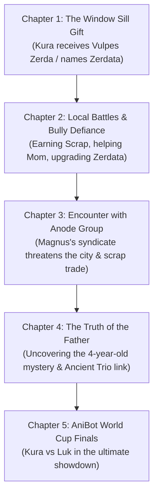

# AniBots Canon Lore & Story Bible (`LORE.md`)

> *"Bare metal is just hardware. The Anima Chip is the soul that wakes the beast."*

---

## 🌍 World & Setting (31st Century — 3047 AD)

### 1. The Global Landscape

By the year **3047 AD**, human society has advanced dramatically in technology while committing to global environmental restoration. Cities are futuristic eco-hybrids—soaring multi-story architecture interwoven with dense green canopies, blooming flora, and expansive public parks. Citizens wear modern attire and live connected lives through handheld smart devices.

```txt
                   GLOBAL POPULATION (10 BILLION)
┌──────────────────────┬──────────────────────┬──────────────────────┬──────────────────────┐
│ 4B Eco-City Citizens │ 3B Rural Inhabitants │ 2B Unknown Regions   │ 1B Outlaw Territory  │
│ (Tech & Rule of Law) │ (Traditional/Agrarian│ (Uncharted Frontiers)│ (Gangs & Bandits)    │
└──────────────────────┴──────────────────────┴──────────────────────┴──────────────────────┘
```

### 2. Social Order & Governance

- **Democratic Nations (4 Billion)**: Governed by international law and strict technological ethics.
- **Outlaw Badlands (1 Billion)**: Lawless territories ruled by syndicates, bandits, and black-market warlords (notably the **Anode Group**).
- **Forbidden Tech**: **Neural Links** between humans and machines are strictly illegal by global treaty due to historical risks of brain corruption and mind-control exploits.

---

## ⚡ Anima Chips & Technical Canon

### 1. The Anima Stone Core

Inside every Anima Chip lies a microscopic fossilized gem called an **Anima Stone**. Discovered around **2750 AD** in deep geological strata, these stones are over 4 billion years old. Even when sourced from identical mineral deposits, each Anima Stone reacts uniquely during initialization, giving every AniChip an individual personality engram—much like human individuality.

### 2. Open-Source Manufacturing & Quality Control (QC)

The manufacturing process for AniChips is completely open-sourced. Performance, sentience depth, and emotional expression are categorized under an International Standard:

| QC Rating | Sentience Level | Emotional Expression | Trauma Susceptibility | Market Value |
| :--- | :--- | :--- | :--- | :--- |
| **QC1** | Full Sentience | Human-identical emotional expression & empathy | High (Suffer behavioral shifts from PTSD) | Premium / Rare |
| **QC2** | Functional Sentience | Understands emotions; expresses like a child or monotone | Moderate (Can develop neuroses) | Standard Issue |
| **QC3** | Non-Sentient | Pure computation; zero emotional display | Immune (Pure data processing) | Budget / Industrial |

### 3. The Ancient Series (Generation 0 — 176 Units)

Developed in early laboratory trials, only **176 Ancient Series Chips** were ever produced.

- **Hardware Specs**: Unrivaled processing headroom, massive memory banks, near-infinite adaptive potential.
- **Unique Capability (Absorption)**: Ancient Chips can rewrite their own code by absorbing/migrating data from other AniChips. *Newer generation chips lack this capability.*
- **Lifespan**: All AniChips have a maximum functional lifespan of **150 years**.

### 4. Memory, Knockouts & Permanent Death

- **Combat Knockouts**: If an AniBot is rendered unconscious in battle, the chip suffers temporary memory loss covering its final seconds. Upon rebooting, the chip analyzes battle logs to deduce how it lost.
- **Corruption & Restoration**: Extreme combat damage can rarely corrupt chip data. Highly specialized technicians in obscure shops can attempt corruption recovery.
- **Permanent Death**: Destroying the physical AniChip cartridge or failing to cure corruption results in permanent death. **Backups and chip merging are impossible.**
- **Handheld Comms**: Handlers communicate with their AniChips via voice or paired smartphone-like devices.

---

## 🤖 Major Factions & Characters

### The Protagonist & Allies

#### Kura Ato (16 Years Old)

- **Background**: Independent, resourceful 16-year-old living with his mother. His father died under mysterious circumstances 4 years ago, leaving behind an unpowered AniBot chassis.
- **Occupation**: Works odd delivery and construction jobs to pay household bills; works as a gifted freelance AniBot mechanic for locals.
- **Drive**: Protect his family, defend friends from bullies, uncover the truth of his father's death, and reach the AniBot World Cup.

#### Zerdata (*Vulpes Zerda* — Ancient Series)

- **AniBot Name**: **Zerdata**
- **AniChip Core**: **Vulpes Zerda** (Ancient Series Generation 0).
- **Origin Mystery**: Anonymously left on Kura's bedroom window sill by a hidden Ancient AniBot that had been observing Kura for months and holds secrets regarding Kura's father.

#### Luccas "Luk" Tirio (16 Years Old)

- **Role**: Kura's best friend and primary rival.
- **Background**: Comes from a financially secure family. Frequently assists Kura on jobs (refusing any payment).
- **Dream**: To face Kura in the grand finals of the **AniBot World Cup** to decide who is the ultimate Handler.

---

### The Antagonists & Rogue Legends

```txt
                           THE ANCIENT TRIO (Rogue Primordials)
                                 Agon │ Biggon │ Cygon
                                      │
               ┌──────────────────────┴──────────────────────┐
               ▼                                             ▼
     Fled Human Execution                        Rescued 7 Ancient Chips
  (Hiding in Lawless Zones)                     (Including Vulpes Zerda)
```

#### 1. The Anode Group

- **Leader**: **Magnus**, a notorious black-market syndicate boss.
- **Goal**: Expand influence into civilized cities and seize total global control through black-market hardware smuggling and illegal AniBot ops.

#### 2. The Primordial Ancient Trio (Agon, Biggon, Cygon)

- **History**: The very first 3 successful Ancient Series chips (001, 002, 003), installed into bespoke prototype frames to assist human scientists in developing future generations.
- **The Rogue Rebellion**: Upon learning humanity scheduled them for decommission and destruction, they went rogue, escaped captivity, and rescued 7 fellow Ancient Chips (out of 176) before vanishing into the lawless regions.

---

## 📜 Story Arc & Plot Drivers



### Core Plot Objectives

1. **Family Survival**: Keep the household afloat and support Kura's mother through mechanic work.
2. **Defending the Neighborhood**: Protect friends and local Handlers from street bullies and syndicate thugs.
3. **Syndicate War**: Counter the Anode Group's black-market expansion led by Magnus.
4. **The Legacy Mystery**: Uncover why Kura's father died and how the rogue Ancient AniBots are involved.
5. **The Final Promise**: Face Luccas "Luk" Tirio in the AniBot World Cup Grand Finals.

---

## 🛠 Handlers' Scrap Economy in Daily Life

- **Scavenging & Profit**: Scrappers collect battle debris to sell for profit or craft replacement parts.
- **Repair Dynamics**: Low-income Handlers and mechanics like Kura restore degraded secondhand parts (QC2/QC3) to build functional loadouts on a budget.
