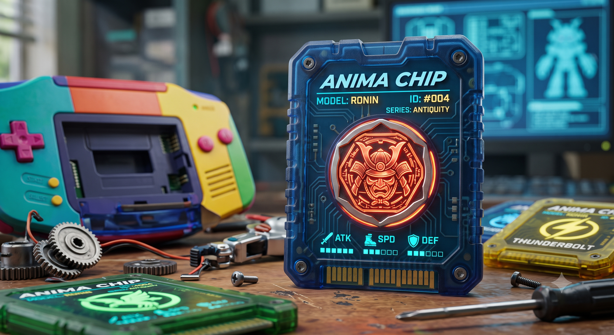
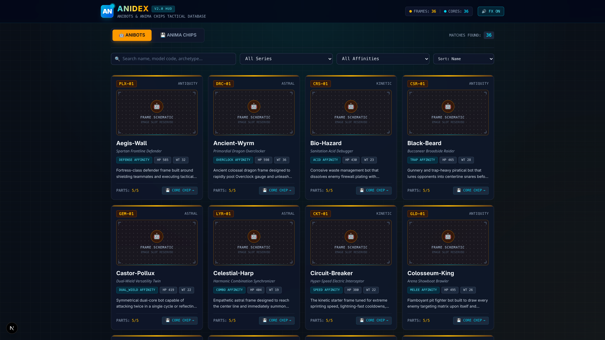

# AniBots



Welcome to the **AniBots** repository!

**AniBots** is a strategic RPG built in **Godot**, featuring deeply customizable robots powered by unique AI cores known as **Anima Chips**. This project blends classic RPG battling mechanics with a robust hardware degradation and management system, where players act as "Handlers" commanding semi-autonomous machines.

## 📚 Project Documentation

The AniBots project is structured across modular, domain-specific documentation files:

| Document | Focus & Domain |
| :--- | :--- |
| **[OVERVIEW.md](./OVERVIEW.md)** | **Game Design Document**: Core combat loop, attributes, autonomous utility AI targeting, degradation, and scrap economy. |
| **[GAME.md](./GAME.md)** | **Technical Implementation Specification**: Godot 4.x architecture, autoloads, composite sprites, and SQLite database schema. |
| **[CHIPS.md](./CHIPS.md)** | **Anima Chips Catalog**: Canonical databank of 36 mass-market AI cores (Antiquity, Kinetic, Astral series). |
| **[LORE.md](./LORE.md)** | **World Bible**: 3047 AD timeline, societal order, geography, main story arcs, and branching quest loops. |
| **[CHARACTERS.md](./CHARACTERS.md)** | **Character & Frame Databank**: Cast bios, Zerdata 5-part chassis anatomy, supporting NPCs, and the 10 Ancient Series cores. |
| **[INSPIRATION/README.md](./INSPIRATION/README.md)** | **Design Roots**: Analysis of classic robot-battler mechanics (Medabots GBA relay system). |
| **[ai/AniChipDesignPrompt.md](./ai/AniChipDesignPrompt.md)** | **AI Art Standard**: Reusable ink schematic sketch prompts for chip illustrations. |
| **[dex/README.md](./dex/README.md)** | **AniDex Web App**: Next.js Pokédex-style databank for browsing 36 frames and 46 chips. |

---

## 🛠 Tech Stack & Architecture

- **Game Engine:** Godot 4.x (GL Compatibility / Desktop & Switch target)
- **Persistence:** SQLite Dual-Database (Static Catalog + ACID Save DB)

For technical architecture details, autoload singletons, and complete SQL table schemas, see **[GAME.md](./GAME.md)**.

---

## 🤖 Core Game Systems

For comprehensive gameplay formulas, hardware equations, and utility AI algorithms, see **[OVERVIEW.md](./OVERVIEW.md)**. Core systems include:

### 1. The Anima Chip (The AI "Soul")

The Anima Chip is the central processor dictating autonomous targeting logic via a **Weighted Scoring System (Utility AI)**. Individual chip profiles and traits are cataloged in **[CHIPS.md](./CHIPS.md)** and **[CHARACTERS.md](./CHARACTERS.md#the-10-legendary-ancient-series-anichips-generation-0)**.

### 2. Modular Hardware Loadouts

Anibots are assembled from customizable parts, forcing players to balance weight, speed, and power:

- **Active Parts (Head, Arms):** Determine HP (Integrity), damage (Payload), speed (Execution/Latency), and accuracy (Precision).
- **Torso (Chassis):** The motherboard that limits the **Max Loadout**, acting as the structural bottleneck to prevent overpowered builds.
- **Legs (Mobility):** Dictate action speed, evasion, and terrain compatibility.

### 3. Combat Pipeline

Combat utilizes a dynamic action bar with distinct phases (Wait, Run, Cooldown). The hardware equipped directly affects transit times. Heavy weapons have high Latency, leaving the Anibot exposed on the center line, while players can use shields to force an "Override Protocol" to intercept attacks.

### 4. Hardware Degradation & Scrap Economy

To bridge the gap between RPG and management games, parts suffer permanent **Condition** degradation if destroyed in combat. Players collect **Scrap** from defeated enemies to synthesize new parts (which start at 40% condition as a "test drive") and must balance using field patches versus real-time Workshop repairs.

## 📱 AniDex Web App

The repository includes **AniDex**, a Next.js Pokédex-style web application located in the [`./dex`](./dex) directory for exploring, searching, and analyzing all AniBots (robot frames) and Anima Chips (AI cores).



### Features

- **Item Databank:** Browse 36 AniBots and 36 Anima Chips with live search and multi-faceted filtering (Series, Affinity, Stats).
- **5-Part Schematics:** Detailed breakdown for Head, Torso, Left/Right Arms, and Legs (Integrity, Payload, Precision, Clock Speed, Latency, Weight).
- **AI Core Specs:** View personality engrams, quote haikus, base stat gauges, passive traits, and ultimate abilities.
- **Cross-Linking:** Quick navigation between AniBots and their preferred Anima Chips.

### Running AniDex Locally

```bash
cd dex
pnpm dev   # or npm run dev
```

Open [http://localhost:3000](http://localhost:3000) in your browser. For complete documentation, see [`./dex/README.md`](./dex/README.md).

## 🚀 Getting Started

Follow these steps to set up the AniBots project locally:

1. **Install Godot Engine**: Download and install Godot (available via [Steam](https://store.steampowered.com/app/404790/Godot_Engine/) or the official [Godot website](https://godotengine.org/)).
2. **Open Godot**: Launch Godot Engine.
3. **Import Project**:
   - In the Godot Project Manager, click **Import**.
   - Browse to the repository and select the `src/` folder (or select `project.godot` inside `src/`).
   - Click **Import & Edit** to open the project.

## 🤝 Contributing

We are building a highly tactical, system-driven RPG and actively welcome contributors across multiple disciplines!

### Open Roles & Skillsets Needed

- **Game Designers**: Balance core combat formulas, scrap economy, part statistics, and Anima Chip behavioral weights.
- **Game Developers**: Build and optimize GDScript systems, SQLite integration, AI utility algorithms, and UI flow in Godot.
- **Brainstormers**: Propose constructive gameplay mechanics, lore expansion, mission structures, and Anima Chip personality concepts.
- **2D & 3D Modelers / Artists**: Create modular robot chassis parts, Anima Chip illustrations, battlefield UI assets, and combat VFX/animations.

### How to Get Started

1. Read our core design documents: **[OVERVIEW.md](./OVERVIEW.md)** (mechanics), **[GAME.md](./GAME.md)** (technical architecture), **[CHIPS.md](./CHIPS.md)** (chips databank), **[LORE.md](./LORE.md)** (story bible), and **[CHARACTERS.md](./CHARACTERS.md)** (cast profiles).
2. Check existing Issues or open a new Discussion/Issue with your ideas or proposed changes.
3. Fork the repository, create your feature branch, and submit a Pull Request.

---

## 🤖 AI Usage Disclaimer

AI tool usage is permitted within this project. We deeply respect all artists and creative creators. Utilizing AI tools enables us to accelerate game development and build an engaging experience for the community to enjoy. All human contributors will be honored and credited for their contributions.
